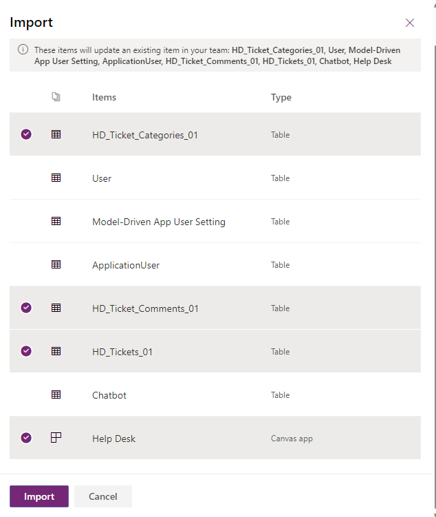

- Deployment Guide
  - [Prerequisites](#prerequisites)
  - [Deployment Steps](#Deployment-Steps)
    - [Create a Team](#1-create-a-team)
    - [Import the Solution to Teams Dataverse](#2-import-the-solution-to-teams-dataverse)
    - [Import the Admin app solution to Teams Dataverse](#3-import-admin-configuration-app)
    - [Import the Flows to Teams Dataverse](#4-import-the-flows-to-teams-dataverse)
    - [Configuration Settings](#5-configuration-settings)
    - [Configuration optional cleanup Flow](#6-configure-cleanup-flow)
    - [Configuration PowerBI report](#7-configure-powerBI-report)
  - [Troubleshooting](#8-troubleshooting)

- - -

# Prerequisites

To begin, you will need:

- An Office 365 subscription where you can create the following kinds of resources:  
  - Teams
  - Power Apps
- A team with the users who will be submitting HelpDesk tickets with this app. (You can add or remove team members later!)
- A copy of the HelpDesk app GitHub repo (<https://github.com/FedSolutions/helpdesk>)

- - -

# Deployment Steps

## 1. Create a Team

It is highly recommended that a dedicated Team is created for the HelpDesk App. To create a Team, follow the guidance below.

1. Open [Teams](https://teams.microsoft.com)
2. Within Teams, select **Teams** from the side-rail.

3. Select **Join or create a team**.

4. Select **Create team**.

5. From the **Create a team** splash screen, select **From scratch**. NOTE: You can use “From a group or team”, but for simplicity, this documentation will start from scratch.

6. From the **What kind of team will this be?** screen, select **Private**. NOTE: Private provides the owner of the Team will control over who will be able to access the HelpDesk app. This Team can be “Public” or “Org-wide” however, this should be determine by your governance.

7. Provide a **Team Name** and **Description**. Select **Create**.
Example:
**Team Name**: Help Desk
**Description**: A location for employees to submit their HelpDesk tickets.

8. Add members to Help Desk. Select **Add**.
NOTE: Add names, distribution list(s), or security group(s). You can always add/remove members later

9. Select **Close**.

10. Congratulations! Your Team is ready!

## 2. Import the Solution to Teams Dataverse

1. Download the solution from the FedSolutions repository here: [Help Desk](https://github.com/FedSolutions/helpdesk)

2. From the side-rail, select **Power Apps**.
NOTE: if you do not see Power Apps in the side-rail, click on Apps and search for Power Apps. Click **Add** (or **Open** if previously added).

3. From the **Build** tab, select the appropriate team and click **See All** link at bottom.

- If no apps appear in list select the **Import your solution link**

4. Clicking on the See all link will take you to following page where you can click on import button

6. From the Select a file pane, select **browse** and navigate to the location where you downloaded the solution in Step 1.

7. Select **Next**.

8. Update connection for Flow. Click select a connection

9. Click on new connection and authenticate to SharePoint

10. Once completed creating a new connection for Flow start import steps again if needed and select the newly created SharePoint connection for the Flow. 

11. On the **Import** pane, verify all items are selected and select **Import**.

12. When the Import is complete, select apps from left menu and click on the Help Desk App. This will open application in PowerApps editor. You may be prompted to allow the data connections

13. Click on allow when prompted for connections and then publish to Team.

Select desired channel to publish app. Once publish is complete you should see Help Desk App and tab within channel.

14. Next create a new column in Teams document library called **LinkedTicketID**. Click on the files tab in Teams where the app is deployed and select Open in SharePoint.

15. Click on the **Add column** and name column **LinkedTicketID**.

16. Update the Flow used for attachment and change site url to proper SharePoint Team site. Browse PowerApps app within Teams and select the Team you deployed Help Desk app.

17. Click on cloud Flows and select the HelpDesk-UploadMultipleFilesToLibrary Flow and edit the Flow.

18. Change destination of SharePoint site by select new site url from the dropdown and republish the Flow. Update the library name to Documents.

19. Click on the save button to republish the Flow.

## 3. Import Admin Configuration App

1. Download the admin app solution from the FedSolutions repository here: [Microsoft FedSolutions Help Desk](https://github.com/FedSolutions/helpdesk)

2. From the side-rail, select **Power Apps**.
NOTE: if you do not see Power Apps in the side-rail, click on Apps and search for Power Apps. Click **Add** (or **Open** if previously added).

3. From the **Build** tab, select the appropriate team and click **See All** link at bottom.

4. Clicking on the See all link will take you to following page where you can click on import button

6. From the Select a file pane, select **browse** and navigate to the location where you downloaded the solution in Step 1.

7. Select **Next**.

8. Click on the **Import** button. 

## 4. Import the Flows to Teams Dataverse

1. Download the solution from the FedSolutions repository here: [Microsoft FedSolutions Help Desk](https://github.com/FedSolutions/helpdesk)

2. From the side-rail, select **Power Apps**.
NOTE: if you do not see Power Apps in the side-rail, click on Apps and search for Power Apps. Click **Add** (or **Open** if previously added).

3. From the **Build** tab, select the appropriate team and click **See All** link at bottom.

4. Clicking on the See all link will take you to following page where you can click on import button

6. From the Select a file pane, select **browse** and navigate to the location where you downloaded the solution in Step 1.

7. Select **Next**.

8. On the **Import** pane, **verify only the following items are selected** and select **Import**.

10. Select and fix all connection references. Once new connection is created click on the refresh button and it should update connection reference. 

11. Click Ok and should take you to another screen and once Flows are imported you will see the following message

## 5. Configuration Settings

There are configuration tables that need updated in order to run the Help Desk application. Setting up the deep linking is a manual process. The other configuration settings can be updated with the admin app.

### Create SharePoint list for image storage

There is a requirement to store images in SharePoint. This reduces the storage required in your Dataverse database. The following steps will help you create a list in SharePoint that can be used to store images.

  1. Open PowerApps within Teams, click on Build tab and select Team where Help Desk app is deployed. 
  2. Select Cloud Flows from left navigation
     
  3. Run the Flow called **CreateTicketAttachmentList**
     
  4. When prompted for SPOUrl enter the URL of SharePoint site where Help Desk app is deployed and click Run Flow. 
     
  5. Naviagte to the SharePoint site where Help Desk app is deployed and select view all site content and click on the **TicketAttachments** list. 
  6. Click on the gear icon on top right of the screen and select **List Settings**.  
     
  7. Click on the **Advanced settings** link from the list settings page.
     
  8. Update the item level security to the following settings and click OK. 
     
### Configuring the deeplink value

In the HD_Ticket_Settings_01S table add a row for DeepLink in Teams. This is required for DeepLink from Teams post to ticket within the Help Desk application.

1. Create the deeplink value by copying the link from Teams under the published tab by selecting **copy link to tab**.

2. Paste the link in Notepad.

3. Replace the word null in url with value **%22TicketID%22** This value is case sensitive so make sure you are using the correct value.

4. Copy deeplink value from Notepad and update HD_Ticket_Settings_01S by opening table in PowerApps and updating the value.

If the value column is not visible click on the Add column button and select Value.

## 6. Configure cleanup Flow

This Flow is optional to deploy and designed to purge data from the Help Desk ticket and comments dataverse tables to conserve space. You may want to take a [backup](https://docs.microsoft.com/en-us/power-platform/admin/backup-restore-environments) or [export] old data prior to running this Flow. 

1. In the HD_Ticket_Settings_01S table add a row for PurgeDays. Enter the numbers of days of data you would like to keep in Help Desk application. The HelpDeskCleanup Flow is schedule to delete all tickets with a **Closed** status older than days specified in PurgeDays record.

2. Edit the HelpDeskCleanUp Flow and set the reoccurrence to desired schedule. You could also change this trigger to be manually invoked instead of scheduled.  

3. To schedule the Flow make sure its turn on.

## 7. Configure PowerBI report

## 8. Troubleshooting
